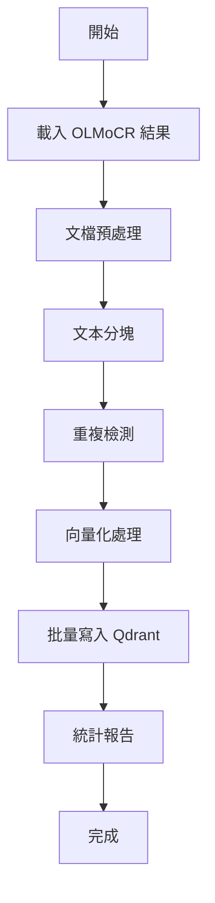

# Embedding Application - OLMoCR 向量資料庫整合

這個應用程式提供完整的 embedding 寫入資料庫的邏輯 pipeline，專門用於處理 OLMoCR 產生的文檔並將其整合到向量資料庫中。

## 功能特色

### 🔄 完整的 Pipeline 流程
- **文檔載入**: 自動載入 OLMoCR 處理結果（JSONL 格式）
- **文本處理**: 智能分塊處理，支援 Markdown 和通用文本分割
- **重複檢測**: 避免重複寫入相同的文檔塊
- **批量處理**: 高效的批量向量化和存儲
- **錯誤處理**: 完整的重試機制和錯誤日誌

### 📊 監控和統計
- 詳細的處理統計信息
- 集合狀態監控
- 完整的日誌記錄
- 處理進度追蹤

## 快速開始

### 1. 環境準備

```bash
# 複製環境變數範本
cp .env.example .env

# 編輯環境變數
nano .env
```

設定你的 OpenAI API Key：
```bash
OPENAI_API_KEY=your_openai_api_key_here
```

### 2. 安裝依賴

```bash
pip install -r requirements.txt
```

### 3. 執行 Pipeline

#### 快速執行
```bash
python3 run_pipeline.py
```

#### 完整執行（含詳細日誌）
```bash
python3 embedding_pipeline.py
```

### 4. 環境變數設定（命令行方式）

```bash
export OPENAI_API_KEY='your-api-key-here'
export QDRANT_URL='http://localhost:6333'
python3 run_pipeline.py
```

## 檔案結構

```
04-embedding-application/
├── embedding_pipeline.py      # 主要 Pipeline 邏輯
├── run_pipeline.py           # 簡化執行腳本
├── config.py                 # 配置文件
├── requirements.txt          # 依賴套件
├── .env.example             # 環境變數範本
├── README.md                # 說明文檔
└── logs/                    # 日誌目錄（自動創建）
```

## 配置說明

### 主要配置參數

| 參數 | 預設值 | 說明 |
|------|--------|------|
| `OPENAI_API_KEY` | - | OpenAI API 金鑰（必填） |
| `QDRANT_URL` | `http://localhost:6333` | Qdrant 資料庫 URL |
| `QDRANT_COLLECTION_NAME` | `olmocr_documents` | 集合名稱 |
| `CHUNK_SIZE` | `1000` | 文本分塊大小 |
| `CHUNK_OVERLAP` | `200` | 分塊重疊大小 |
| `BATCH_SIZE` | `50` | 批量處理大小 |

### 文本處理策略

應用程式支援多種文本處理策略：

- **Markdown**: 適用於結構化文檔
- **Academic Paper**: 適用於學術論文
- **General Text**: 通用文本處理

## Pipeline 執行流程



## 輸出示例

```bash
🧪 Embedding Pipeline - OLMoCR 向量資料庫寫入工具
======================================================================

🔧 Pipeline 配置:
   - Qdrant URL: http://localhost:6333
   - 集合名稱: olmocr_documents
   - Embedding 模型: text-embedding-ada-002
   - 文本塊大小: 1000
   - 批次大小: 50

🚀 開始 Embedding Pipeline 執行...
📁 載入 OLMoCR 結果...
找到 3 個 OLMoCR 結果文件
總共載入 3 筆 OLMoCR 記錄

📝 處理文檔...
生成了 457 個文檔塊

🗄️ 準備向量資料庫...
集合 olmocr_documents 已存在

💾 添加文檔到向量資料庫...
成功添加批次 1: 50 個文檔
成功添加批次 2: 50 個文檔
...

🎉 Embedding Pipeline 執行完成！
📊 處理統計: 處理文檔 457 個，添加 457 個

==================================================
🎉 Pipeline 執行成功！
📊 處理文檔: 457 個
💾 新增文檔: 457 個
🗄️ 資料庫統計:
   - 總向量數: 457
   - 向量維度: 1536
```

## 錯誤處理

Pipeline 包含完整的錯誤處理機制：

- **連線錯誤**: 自動重試 Qdrant 連線
- **API 限制**: OpenAI API 呼叫限制處理
- **資料格式錯誤**: 跳過無效的文檔塊
- **重複資料**: 自動檢測和跳過已存在的文檔

## 監控和日誌

- 日誌文件位置: `logs/embedding_app.log`
- 支援多層級日誌（INFO, WARNING, ERROR）
- 處理統計和性能監控
- 詳細的錯誤追蹤

## 進階使用

### 自定義配置

可以通過修改 `config.py` 來調整處理策略：

```python
# 調整文本分塊策略
TEXT_PROCESSING_STRATEGIES['custom'] = {
    'primary_splitter': 'RecursiveCharacterTextSplitter',
    'chunk_size': 1500,
    'chunk_overlap': 300
}
```

### 程式化使用

```python
from embedding_pipeline import EmbeddingPipeline

# 創建 pipeline
pipeline = EmbeddingPipeline()

# 執行處理
results = pipeline.run_pipeline()

# 獲取統計
stats = pipeline.get_collection_stats()
```

## 疑難排解

### 常見問題

1. **API Key 錯誤**
   ```bash
   export OPENAI_API_KEY='your-actual-api-key'
   ```

2. **Qdrant 連線失敗**
   - 確保 Qdrant 服務正在運行
   - 檢查 URL 和端口設定

3. **記憶體不足**
   - 減少 `BATCH_SIZE`
   - 減少 `CHUNK_SIZE`

4. **處理速度慢**
   - 增加 `BATCH_SIZE`
   - 檢查網路連線

## 🔍 Vector Database 檢索策略教學

除了基本的 embedding pipeline 之外，本專案還包含了完整的向量檢索策略教學程式，涵蓋 2025 年最新的檢索技術。

### 📚 教學內容

| 分類 | 策略 | 檔案位置 |
|------|------|----------|
| **基礎策略** | 語義搜索、元數據過濾、混合搜索 | `vector_search_strategies_tutorial.ipynb` |
| **高級策略** | 查詢擴展、HyDE、LLM 重排序 | 同上 |
| **RAG 2.0** | 自適應檢索、多跳推理 | 同上 |
| **Qdrant 特有** | Discovery API、Recommendation API | 同上 |

### 🚀 使用檢索教學

#### 1. 啟動 Jupyter Notebook
```bash
jupyter notebook vector_search_strategies_tutorial.ipynb
```

#### 2. 或運行測試腳本
```bash
python test_search_strategies.py
```

### 📊 當前數據狀態

```
🗄️ Qdrant 集合: olmocr_documents
   - 總向量數量: 5,275 個
   - 向量維度: 1536
   - 數據來源: 學術論文 (IF_*, MM_* 系列)
```

### 🎯 檢索策略範例

```python
# 語義搜索
semantic_search("transformer attention mechanism", limit=5)

# 混合搜索 (語義 + 關鍵詞)
hybrid_search(
    query="neural networks",
    keywords=["transformer", "attention"],
    limit=5
)

# 查詢擴展
expanded_search("deep learning", expansion_method="technical")

# HyDE 檢索
hyde_search("attention mechanisms in transformers")

# 自適應檢索
adaptive_retrieval("Compare transformer and CNN architectures")
```

### 📈 性能基準測試

教學程式包含完整的檢索策略性能比較：
- 執行時間測試
- 檢索質量評估
- 效率指標分析
- 可視化結果展示

## 依賴要求

- Python 3.8+
- OpenAI API 訪問權限
- Qdrant 向量資料庫
- 足夠的系統記憶體（建議 4GB+）
- Jupyter Notebook (用於交互式教學)

## 許可證

此項目用於研究和開發目的。# multimodal-RAG-course
